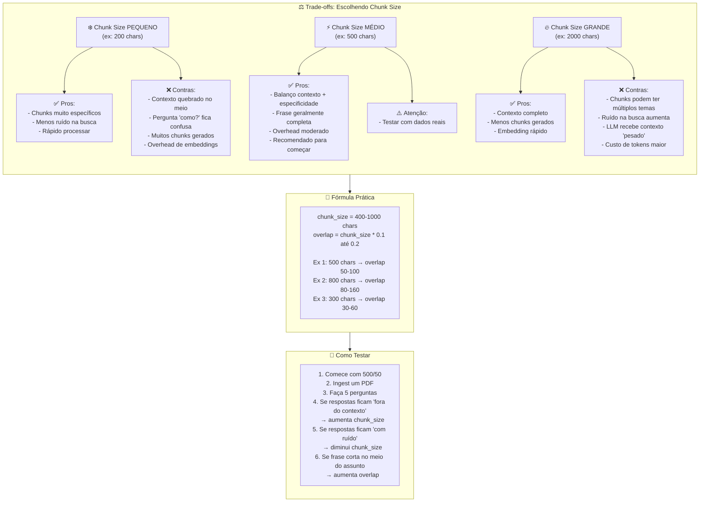
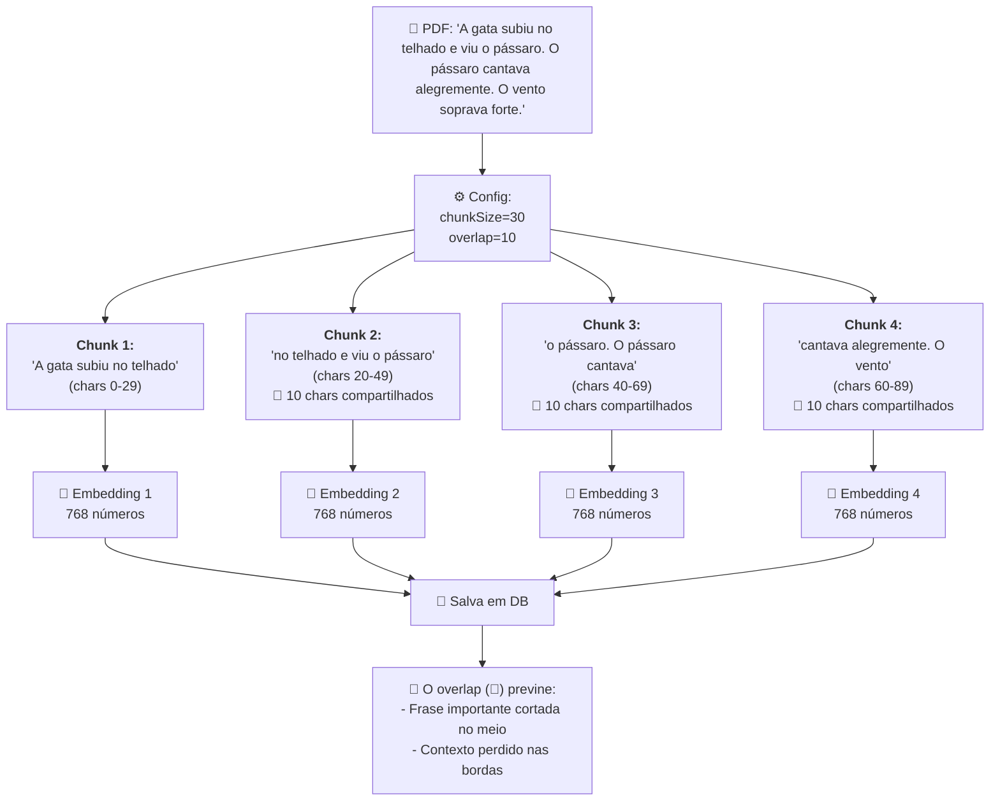
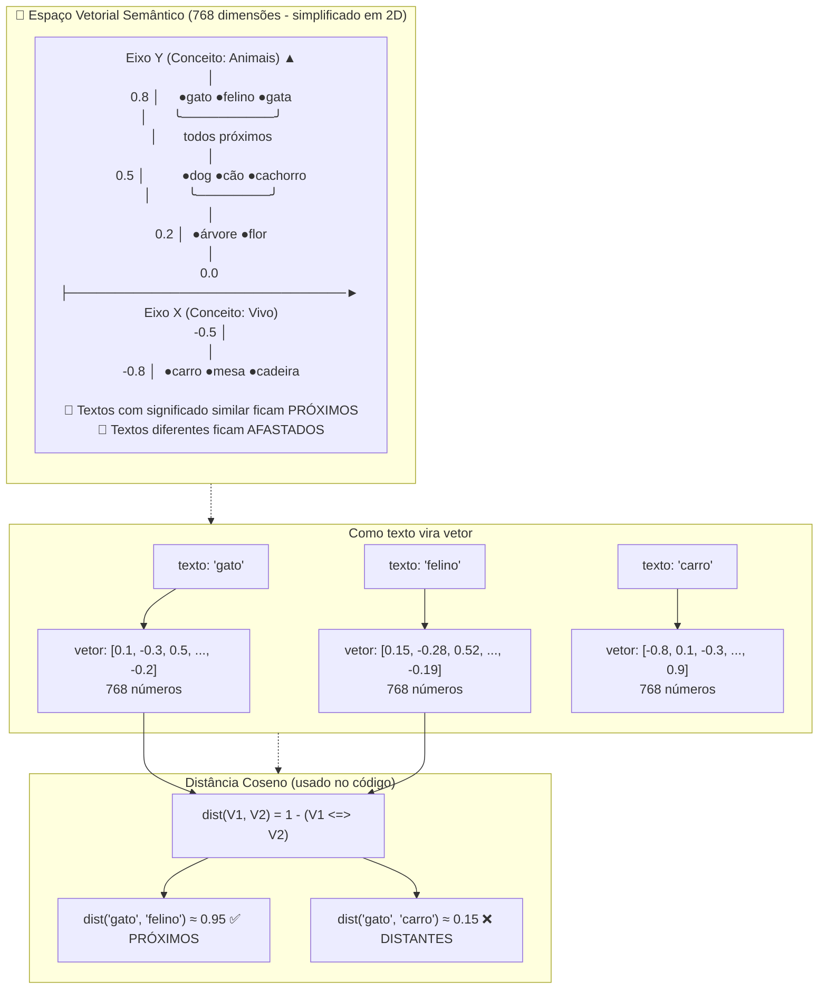
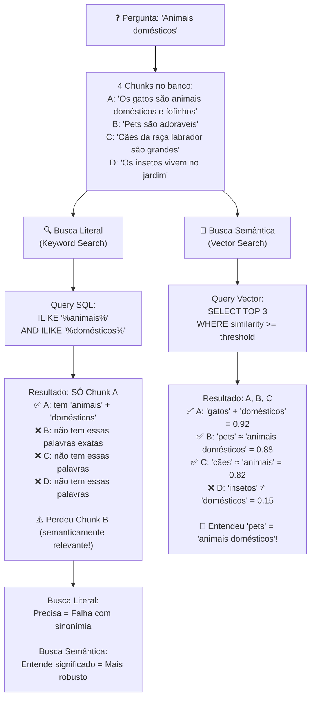
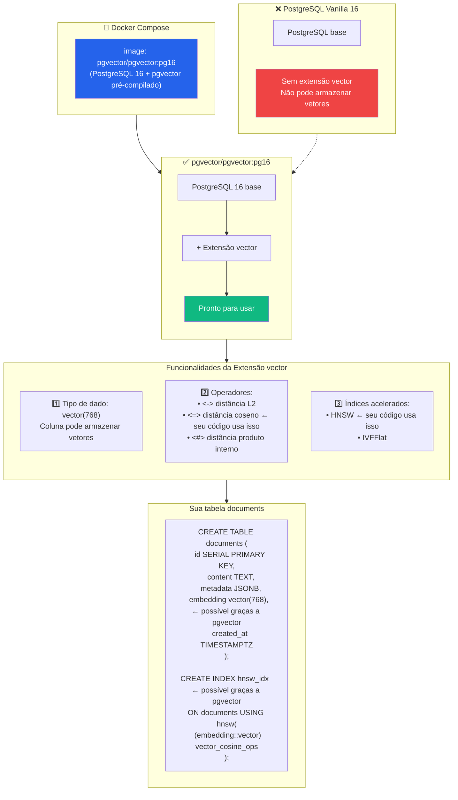
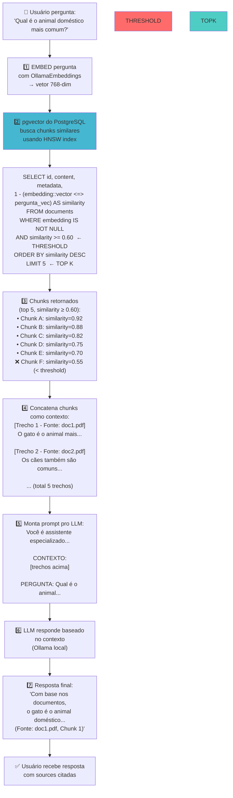

# RAG (Retrieval-Augmented Generation) - Guia Completo

## Índice
1. [Introdução](#introdução)
2. [Chunk Size & Overlap](#chunk-size--overlap)
3. [Embedding](#embedding)
4. [Busca por Igualdade Literal vs Semântica](#busca-por-igualdade-literal-vs-semântica)
5. [Threshold](#threshold)
6. [pgvector - Extensão PostgreSQL](#pgvector---extensão-postgresql)
7. [Fluxo Completo](#fluxo-completo)
8. [Cheat Sheet](#cheat-sheet)
9. [Como Testar](#como-testar)

---

## Introdução

**RAG (Retrieval-Augmented Generation)** é um padrão que:

1. **Recupera** (Retrieval) documentos relevantes de um banco de dados
2. **Aumenta** (Augment) o prompt da LLM com esses documentos como contexto
3. **Gera** (Generation) uma resposta baseada no contexto

No projeto `rag-agent`, esse fluxo é:
- **Ingestão**: PDF → Chunks → Embeddings → pgvector Database
- **Busca**: Pergunta → Embedding → Vector Search → Top K chunks
- **Resposta**: Chunks + Instrução → LLM → Resposta com sources

---

## Chunk Size & Overlap

### O que é

**Chunk Size** = tamanho de cada "pedaço" do texto em caracteres  
**Overlap** = quantos caracteres se repetem entre chunks consecutivos

### Exemplo Prático

Texto original:
```
"A gata subiu no telhado e viu o pássaro. O pássaro cantava alegremente. O vento soprava forte."
```

Com `chunkSize=30, overlap=10`:

```
Chunk 1: "A gata subiu no telhado" (chars 0-29)
Chunk 2: "no telhado e viu o pássaro" (chars 20-49)    ← 10 chars repetidos
Chunk 3: "o pássaro. O pássaro cantava" (chars 40-69)  ← 10 chars repetidos
Chunk 4: "cantava alegremente. O vento" (chars 60-89)  ← 10 chars repetidos
```

### Por que Overlap é importante

- **Sem overlap**: Frases importantes podem ser cortadas no meio entre chunks
- **Com overlap**: Contexto é preservado nas bordas
- **Exemplo de problema**: "O pássaro *[BOUNDARY]* cantava alegremente"

### Como Decidir o Overlap

**Regra prática**: overlap = 10-20% do chunk size

```
chunk_size = 500  →  overlap = 50-100
chunk_size = 800  →  overlap = 80-160
chunk_size = 300  →  overlap = 30-60
```

### Trade-offs: Escolhendo Chunk Size

#### ❄️ Chunk Size PEQUENO (200 chars)

```
✅ Vantagens:
- Chunks muito específicos
- Menos ruído nas buscas
- Processamento rápido

❌ Desvantagens:
- Contexto quebrado no meio
- Resposta fica confusa ("Qual é o assunto principal?")
- Muitos chunks gerados (overhead)
```

#### ⚡ Chunk Size MÉDIO (500 chars) **[RECOMENDADO]**

```
✅ Vantagens:
- Balanço entre contexto e especificidade
- Frase geralmente completa
- Overhead moderado
- Bom para começar

⚠️ Recomendação:
- Testar com seus dados reais
```

#### 🔥 Chunk Size GRANDE (2000 chars)

```
✅ Vantagens:
- Contexto completo
- Menos chunks gerados
- Embedding rápido

❌ Desvantagens:
- Chunks podem ter múltiplos temas desconexos
- Ruído aumenta na busca
- LLM recebe contexto "pesado"
- Custo de tokens maior
```

### Visualização: Trade-offs ao Escolher Chunk Size



### Testando na Prática

1. Comece com `chunk_size=500, overlap=50`
2. Ingest um PDF
3. Faça 5 perguntas
4. Analise:
   - Se respostas ficam "fora do contexto" → **aumenta** chunk_size
   - Se respostas ficam "com ruído" → **diminui** chunk_size
   - Se frase corta no meio do assunto → **aumenta** overlap

### Visualização: Chunk Size & Overlap



---

## Embedding

### O que é

**Embedding** é uma representação numérica (vetor) de um texto. Cada número no vetor captura um aspecto do significado do texto.

### Exemplo Simplificado

```
Texto: "gato"
Embedding 768-dimensional: [0.1, -0.3, 0.5, ..., -0.2]
                            ↑     ↑     ↑        ↑
                        768 números capturando significado
```

### Propriedade Chave: Textos Similares Ficam Próximos

No espaço vetorial:
- "gato" ≈ "felino" ≈ "gata" → **vetores próximos**
- "cão" ≠ "gato" → **vetores distantes**

### Visualmente (simplificado em 2D)

```
                  ▲ Eixo Y (Conceito: Animais)
                  │
              0.8 │     ●gato ●felino ●gata
                  │       ╰──────────╯
                  │       todos próximos
                  │
              0.5 │          ●dog ●cão ●cachorro
                  │          ╰────────╯
                  │
              0.2 │  ●árvore ●flor
                  │
              0.0 ├──────────────────────────────────► Eixo X (Conceito: Vivo)
                 -0.5 │
                  │
                 -0.8 │  ●carro ●mesa ●cadeira

📌 Textos com significado similar ficam PRÓXIMOS
📌 Textos diferentes ficam AFASTADOS
```

### Como Funciona no seu Projeto

- **Provider**: `OllamaEmbeddingProvider`
- **Biblioteca**: LangChain + Ollama
- **Modelo**: `OLLAMA_EMBEDDING_MODEL` (ex: `nomic-embed-text`)
- **Dimensionalidade**: 768 dimensões
- **Crítico**: Use o **mesmo modelo** na ingestão E na busca!

Se usar modelos diferentes, os vetores não serão comparáveis.

### Visualização: Embedding & Espaço Vetorial



---

## Busca por Igualdade Literal vs Semântica

### Busca Literal (Keyword Search)

Procura por palavras exatas no texto:

```sql
SELECT * FROM documents 
WHERE content ILIKE '%igualdade%'
```

#### Vantagens
- ✅ Preciso (encontra exatamente o que pediu)
- ✅ Rápido (usa índices simples)

#### Desvantagens
- ❌ Falha com sinonímia: "gato" não encontra "felino"
- ❌ Falha com typos: "gato" não encontra "gto"
- ❌ Falha com variações: "correr" não encontra "corrida"

#### Exemplo

```
Pergunta: "animais domésticos"

Chunks encontrados:
✅ "Os gatos são animais domésticos e fofinhos"   (tem "animais" E "domésticos")
❌ "Pets são adoráveis"                           (não tem essas palavras exatas)
❌ "Cães da raça labrador são grandes"            (não tem essas palavras)

⚠️ Perdeu "Pets" que seria semanticamente relevante!
```

---

### Busca Semântica (Vector Search)

Procura por **significado**, não por palavras exatas.

**Funcionamento**:
1. Pergunta é embedada → vetor 768-dim
2. Cada chunk já tem seu vetor (pré-computado)
3. Calcula distância entre vetores
4. Retorna os K mais próximos

#### Vantagens
- ✅ Encontra **significado**, não só palavras
- ✅ "gato" encontra "felino", "animal doméstico", "miau"
- ✅ Robusto a variações de linguagem

#### Desvantagens
- ❌ Mais caro computacionalmente
- ❌ Qualidade depende do modelo de embedding

#### Exemplo

```
Pergunta: "animais domésticos"

Chunks encontrados (com similaridade):
✅ A: 'Os gatos são animais domésticos' = 0.92
✅ B: 'Pets são adoráveis' = 0.88
✅ C: 'Cães são companheiros' = 0.82

🎉 Entendeu que "pets" ≈ "animais domésticos"!
```

---

### Comparação Lado a Lado

| Aspecto | Literal | Semântica |
|---------|---------|-----------|
| **Procura por** | Palavras exatas | Significado |
| **"gato" encontra** | gato, GATO, gat-o | gato, felino, miau, gata |
| **"pets" encontra** | pets, Pets | pets, animais, domésticos, cães |
| **Velocidade** | Rápida (índice texto) | Mais lenta (cálculo vetorial) |
| **Índice** | B-tree, LIKE | HNSW, IVFFlat |
| **Melhor para** | Dados estruturados | Documentos com sinonímia |

### Visualização: Keyword vs Vector Search



---

## Threshold

### O que é

**Threshold** é o valor mínimo de similaridade (0.0 a 1.0) que um chunk precisa ter com a pergunta para ser considerado "relevante".

### Fórmula (usada no código)

```
similarity = 1 - (embedding_chunk <=> embedding_pergunta)
                        ↑
                    distância coseno
```

**Interpretação**:
- `similarity = 1.0` → vetores idênticos (pergunta = chunk)
- `similarity = 0.5` → meio parecido
- `similarity = 0.0` → completamente diferente
- **threshold = 0.6** → só chunks ≥0.6 são aceitos

### Impacto de Diferentes Thresholds

#### Scenario 1: threshold = 0.3 (muito baixo)

```
Pergunta: "Como treinar um cão?"

Chunks encontrados:
✅ A: 'Adestramento canino requer paciência' = 0.91
✅ B: 'Gatos também precisam de treino' = 0.72
✅ C: 'Exercício diário é importante para pets' = 0.68
⚠️ D: 'A culinária italiana é famosa' = 0.15

⚠️ PROBLEMA: Inclui "culinária" (irrelevante)
Resposta fica com ruído e confusa
```

#### Scenario 2: threshold = 0.6 (recomendado) **[BOM]**

```
Pergunta: "Como treinar um cão?"

Chunks encontrados:
✅ A: 'Adestramento canino requer paciência' = 0.91
✅ B: 'Gatos também precisam de treino' = 0.72
⏹️ C: 'Exercício diário é importante para pets' = 0.68 (descartado)
❌ D: 'A culinária italiana é famosa' = 0.15

✅ BOM: Filtrou ruído, manteve contexto relevante
Resposta precisa e bem contextualizada
```

#### Scenario 3: threshold = 0.9 (muito alto)

```
Pergunta: "Como treinar um cão?"

Chunks encontrados:
✅ A: 'Adestramento canino requer paciência' = 0.91
❌ B: 'Gatos também precisam de treino' = 0.72 (descartado)
❌ C: 'Exercício diário é importante para pets' = 0.68 (descartado)
❌ D: 'A culinária italiana é famosa' = 0.15

⚠️ PROBLEMA: Muito restritivo
Perdeu contexto útil sobre gatos e exercício
Pode retornar "Não encontrei informação relevante"
```

### Recomendações

```
Teste padrão: threshold = 0.6
- Se muitas respostas irrelevantes → aumenta para 0.7-0.75
- Se poucas respostas encontradas → diminui para 0.5-0.55
- Se respostas estão OK → mantenha 0.6
```

No código: `RAG_SIMILARITY_THRESHOLD` no `.env`

### Visualização: Threshold - Impacto na Qualidade

```mermaid
graph TB
    Q["❓ Pergunta: 'Como treinar um cão?'"]
    
    Q --> CHUNKS["Chunks encontrados (com similaridade):<br/>A: 'Adestramento canino requer paciência' = 0.91<br/>B: 'Gatos também precisam de treino' = 0.72<br/>C: 'Exercício diário é importante para pets' = 0.68<br/>D: 'A culinária italiana é famosa' = 0.15"]
    
    CHUNKS --> T1["Scenario 1: threshold = 0.3<br/>(muito baixo)"]
    CHUNKS --> T2["Scenario 2: threshold = 0.6<br/>(recomendado)"]
    CHUNKS --> T3["Scenario 3: threshold = 0.9<br/>(muito alto)"]
    
    T1 --> R1["Resultado 1:<br/>✅ A (0.91)<br/>✅ B (0.72)<br/>✅ C (0.68)<br/>⚠️ D (0.15)<br/><br/>⚠️ PROBLEMA: Inclui 'culinária'<br/>resposta fica com ruído"]
    
    T2 --> R2["Resultado 2:<br/>✅ A (0.91)<br/>✅ B (0.72)<br/>⏹️ C (0.68) ← descartado<br/>❌ D (0.15)<br/><br/>✅ BOM: Filtrou ruído<br/>manteve contexto relevante"]
    
    T3 --> R3["Resultado 3:<br/>✅ A (0.91)<br/>❌ B (0.72) ← descartado<br/>❌ C (0.68) ← descartado<br/>❌ D (0.15)<br/><br/>⚠️ PROBLEMA: Muito restritivo<br/>perdeu contexto útil sobre gatos"]
    
    R1 --> IMPACT1["Impacto: Resposta pode<br/>incluir informações<br/>irrelevantes e confusos"]
    R2 --> IMPACT2["Impacto: Resposta precisa<br/>e bem contextualizada<br/>(Recomendado!)"]
    R3 --> IMPACT3["Impacto: Resposta genérica<br/>ou 'Não encontrei<br/>informação relevante'"]
    
    style R1 fill:#fbbf24,color:#000
    style R2 fill:#10b981,color:#fff
    style R3 fill:#ef4444,color:#fff
    style IMPACT1 fill:#fbbf24,color:#000
    style IMPACT2 fill:#10b981,color:#fff
    style IMPACT3 fill:#ef4444,color:#fff
```



---

## pgvector - Extensão PostgreSQL

### Qual é a imagem

No seu `docker-compose.yml`:

```yaml
postgres:
  image: pgvector/pgvector:pg16
```

Esta é uma **imagem customizada** do PostgreSQL 16 com a extensão **pgvector** pré-compilada.

### Por que não usar PostgreSQL vanilla

Se usasse `postgres:16` (vanilla):

```bash
# Precisaria compilar a extensão manualmente
apt-get install postgresql-16-pgvector
# ou compilar do source
```

Com `pgvector/pgvector:pg16`, já vem **pronto para usar**.

### O que pgvector Oferece

#### 1️⃣ Tipo de Dado: `vector`

```sql
CREATE TABLE documents (
  embedding vector(768)  -- vetor de 768 dimensões
);
```

Cada coluna `embedding` pode armazenar um vetor de números.

#### 2️⃣ Operadores de Proximidade

Calcula distância entre vetores:

```sql
-- Distância L2 (euclidiana)
SELECT * FROM documents 
WHERE embedding <-> query_vector < 0.5

-- Distância Coseno (seu código usa isso)
SELECT *, 1 - (embedding <=> query_vector) AS similarity
FROM documents
ORDER BY similarity DESC

-- Distância Produto Interno
SELECT * FROM documents
WHERE embedding <#> query_vector < 0.5
```

#### 3️⃣ Índices Acelerados

Duas estratégias para busca rápida:

**HNSW** (seu código usa):
- Rápido (tempo O(log n))
- Usa mais memória
- Melhor para buscas online em tempo real

```sql
CREATE INDEX documents_embedding_hnsw_idx
ON documents USING hnsw (
  (embedding::vector(768)) vector_cosine_ops
);
```

**IVFFlat**:
- Usa menos memória
- Mais lento
- Melhor para datasets muito grandes

```sql
CREATE INDEX documents_embedding_ivf_idx
ON documents USING ivfflat (
  (embedding::vector(768)) vector_cosine_ops
)
WITH (lists = 100);
```

### Query Vetorial (seu código)

```sql
SELECT id, content, metadata, 
       1 - (embedding::vector <=> $1::vector) AS similarity
FROM documents
WHERE embedding IS NOT NULL
  AND 1 - (embedding::vector <=> $1::vector) >= $2
ORDER BY similarity DESC
LIMIT $3
```

**O que acontece**:
1. `$1::vector` = casting do embedding da pergunta para tipo vector
2. `embedding <=> $1::vector` = distância coseno
3. `1 - (...)` = converte para similaridade (0-1)
4. `>= $2` = filtra pelo threshold
5. `LIMIT $3` = pega top K

### Visualização: pgvector - A Extensão do PostgreSQL



---

## Fluxo Completo

### 📥 INGESTÃO

```
1. PDF chega
   └─ via API /documents/ingest
   
2. Extract text
   └─ pdfParse converte PDF → texto bruto
   
3. Split chunks
   └─ RecursiveCharacterTextSplitter quebra texto
   └─ chunkSize=500, overlap=50 (configurável)
   
4. Embed chunks
   └─ OllamaEmbeddingProvider (768-dim)
   └─ Usa modelo nomic-embed-text
   
5. Salva em DB
   └─ Cada chunk com (content, embedding, metadata)
   └─ Metadata inclui: source, chunkIndex, totalChunks
```

### 🔍 BUSCA

```
1. Pergunta recebida
   └─ via API /chat
   
2. Embed pergunta
   └─ Mesmo modelo (nomic-embed-text)
   └─ Gera vetor 768-dim
   
3. Query Vector DB
   └─ pgvector com HNSW index
   └─ Calcula distância coseno
   
4. Filtra e Limita
   └─ Similarity >= RAG_SIMILARITY_THRESHOLD (0.6)
   └─ LIMIT RAG_TOP_K (5)
   
5. Chunks Similares
   └─ Ordenados por similaridade DESC
```

### 💬 RESPOSTA

```
1. Concatena contexto
   └─ Monta string com os chunks encontrados
   └─ Formato: "[Trecho 1 - Fonte: doc.pdf]\n{content}"
   
2. Monta prompt
   └─ Instrução do sistema
   └─ CONTEXTO: [chunks concatenados]
   └─ PERGUNTA: [pergunta original]
   
3. LLM responde
   └─ Ollama local (qwen2.5 ou similar)
   └─ Gera resposta baseada no contexto
   
4. Retorna resposta
   └─ Answer text
   └─ Sources (similarDocuments array)
```

### Visualização: Pipeline Completo RAG End-to-End



---

## Cheat Sheet

| Conceito | Função | Arquivo | Configuração |
|----------|--------|---------|--------------|
| **Chunk Size** | Tamanho em chars | `ingest-documents.service.ts` | `RAG_CHUNK_SIZE` |
| **Overlap** | Repetição (%), 10-20% | `ingest-documents.service.ts` | `RAG_CHUNK_OVERLAP` |
| **Embedding** | Texto → 768-dim | `embedding.provider.ts` | `OLLAMA_EMBEDDING_MODEL` |
| **Threshold** | Filtro similaridade | `documents.repository.ts` | `RAG_SIMILARITY_THRESHOLD` |
| **Top K** | Quantos chunks | `chat.service.ts` | `RAG_TOP_K` ou query `topK` |
| **Distância** | Similaridade | `documents.repository.ts` | `<=>` (coseno) |
| **Index** | Busca acelerada | `CreateDocumentsTable.ts` | `HNSW` |
| **Banco Vetorial** | Armazena vetores | `docker-compose.yml` | `pgvector/pgvector:pg16` |

---

## Como Testar

### Pré-requisitos

```bash
cd rag-agent/backend

# Verificar se Docker está rodando
docker-compose up -d

# Esperar pelos services (postgres, ollama)
docker-compose ps
```

### 1️⃣ Verificar Ambiente

```bash
# Ver variáveis de ingestão
grep RAG .env

# Esperado:
# RAG_CHUNK_SIZE=500
# RAG_CHUNK_OVERLAP=50
# RAG_SIMILARITY_THRESHOLD=0.6
# RAG_TOP_K=5
```

### 2️⃣ Ingest um PDF

```bash
curl -X POST http://localhost:3000/documents/ingest \
  -F "files=@seu-arquivo.pdf"

# Resposta esperada:
{
  "data": [
    {
      "fileName": "seu-arquivo.pdf",
      "chunks": 42,
      "status": "success"
    }
  ]
}
```

### 3️⃣ Faça Perguntas

```bash
curl -X POST http://localhost:3000/chat \
  -H "Content-Type: application/json" \
  -d '{
    "question": "O que é RAG?",
    "topK": 3
  }'

# Resposta esperada:
{
  "data": {
    "answer": "Com base nos documentos, RAG...",
    "sources": [
      {
        "source": "seu-arquivo.pdf",
        "content": "Trecho do documento...",
        "similarity": 0.92
      }
    ]
  }
}
```

### 4️⃣ Análise e Ajustes

| Observação | Diagnóstico | Ação |
|------------|------------|------|
| Respostas muito genéricas | Chunks não incluem contexto suficiente | **↑ chunk_size** (ex: 800) |
| Respostas com informações ruins | Chunks incluem múltiplos temas | **↓ chunk_size** (ex: 300) |
| "Não encontrei informação" | Threshold muito alto | **↓ threshold** (ex: 0.5) |
| Respostas com muito ruído | Threshold muito baixo | **↑ threshold** (ex: 0.7) |
| Frase corta no meio | Overlap insuficiente | **↑ overlap** (ex: 100) |

### 5️⃣ Teste Completo

```bash
# Terminal 1: Monitorar logs
docker-compose logs -f postgres

# Terminal 2: Ingest 3 PDFs diferentes
for pdf in doc1.pdf doc2.pdf doc3.pdf; do
  curl -X POST http://localhost:3000/documents/ingest \
    -F "files=@$pdf"
done

# Terminal 3: Faça 10 perguntas
# Analise se as respostas estão boas
# Se sim: done!
# Se não: ajuste RAG_CHUNK_SIZE e RAG_SIMILARITY_THRESHOLD
```

---

## Referências Rápidas

### Arquivos Principais

- [chat.service.ts](../do-yourself/rag-agent/backend/src/modules/chat/services/chat.service.ts) - Lógica de busca e resposta
- [ingest-documents.service.ts](../do-yourself/rag-agent/backend/src/modules/documents/services/ingest-documents.service.ts) - Lógica de ingestão
- [documents.repository.ts](../do-yourself/rag-agent/backend/src/modules/documents/repositories/documents.repository.ts) - Query vetorial
- [embedding.provider.ts](../do-yourself/rag-agent/backend/src/@shared/providers/ollama/embedding.provider.ts) - Geração de embeddings
- [CreateDocumentsTable.ts](../do-yourself/rag-agent/backend/src/@database/migrations/1700000000000-CreateDocumentsTable.ts) - Schema com pgvector

### Variáveis de Ambiente

```env
# Chunking
RAG_CHUNK_SIZE=500
RAG_CHUNK_OVERLAP=50

# Busca
RAG_SIMILARITY_THRESHOLD=0.6
RAG_TOP_K=5

# Embeddings
OLLAMA_EMBEDDING_MODEL=nomic-embed-text
OLLAMA_BASE_URL=http://localhost:11434

# LLM
OLLAMA_LLM_MODEL=qwen2.5-coder:latest
```

### Comandos Úteis

```bash
# Conectar ao PostgreSQL
docker-compose exec postgres psql -U raguser -d ragdb

# Ver chunks armazenados
SELECT id, content, similarity_score, metadata 
FROM documents 
LIMIT 5;

# Ver quantidade de chunks por documento
SELECT metadata->>'source' as source, COUNT(*) as chunks
FROM documents
GROUP BY source;

# Limpar chunks de um documento
DELETE FROM documents 
WHERE metadata->>'source' = 'arquivo.pdf';
```

---

**Última atualização**: 17 de maio de 2026
