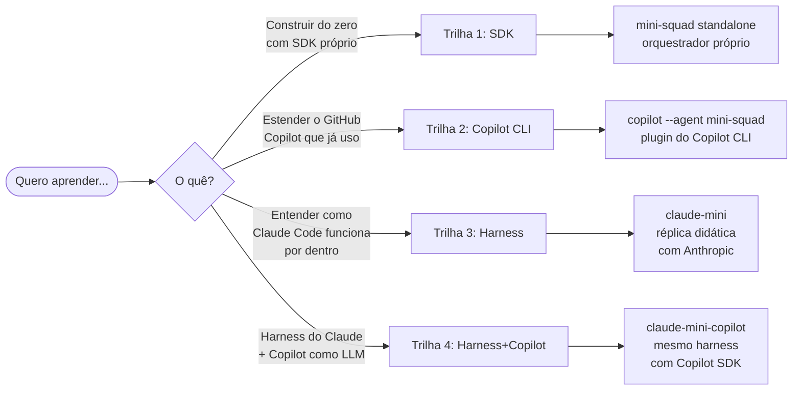

# Custom Agent — Tutoriais de Orquestração de Agents em TypeScript

Quatro trilhas paralelas, **independentes**, mas que se complementam. Escolha por objetivo.

## As quatro trilhas

### 🛠 [Trilha 1 — SDK & Orquestração própria](track-1-sdk/README.md)

> Você quer **construir um orquestrador de agents do zero** em TypeScript, controlando o loop ReAct, tool-calling, multi-agent routing e governance.

- **Resultado:** binário `mini-squad` standalone que cota orçamentos em 3 plataformas paralelas.
- **Tecnologia:** `@github/copilot-sdk`, Zod, Vitest, `commander`.
- **Quando usar:** projetos próprios, fora do ecossistema Copilot, embarcado, com providers diferentes.
- **Tempo estimado:** 11 fases / ~22 capítulos.

### 🤖 [Trilha 2 — Copilot CLI (`--agent mini-squad`)](track-2-copilot/README.md)

> Você quer transformar o Copilot que já usa em **um orquestrador multi-agent custom**, sem reinventar transport/auth/loop.

- **Resultado:** definição de agent custom + tools que o `copilot --agent mini-squad --yolo` carrega.
- **Tecnologia:** GitHub CLI (`gh`), Copilot CLI, Markdown frontmatter, scripts shell.
- **Quando usar:** já tem Copilot, quer adicionar workflows de domínio, integrar com issues/PRs.
- **Tempo estimado:** 8 capítulos.
- **Pré-requisito:** ler [Trilha 1 §03-tools](track-1-sdk/03-tools/01-tool-registry-pattern.md) ajuda, mas não é obrigatório.

### 🔬 [Trilha 3 — Construindo um Harness (estilo Claude Code)](track-3-harness/README.md)

> Você quer **entender como o Claude Code funciona por dentro** e construir uma versão didática (`claude-mini`) replicando os 12 mecanismos progressivos do harness.

- **Resultado:** binário `claude-mini` com loop ReAct + tool dispatch + planning + sub-agents + skills + compaction + tasks + background + teams + protocols + autonomous + worktrees.
- **Tecnologia:** Anthropic SDK (ou Copilot SDK adaptado), AsyncGenerator streaming, Bun-style feature flags.
- **Referência:** [DouglasHennrich/claude-code-source-code](https://github.com/DouglasHennrich/claude-code-source-code) (Claude Code v2.1.88 reverse engineering).
- **Quando usar:** quer aprender harness production-grade, está construindo seu próprio agente CLI.
- **Tempo estimado:** intro + 12 capítulos (1 por mecanismo).

### 🔄 [Trilha 4 — Harness com Copilot como LLM](track-4-harness-copilot/README.md)

> Você quer **o mesmo harness do `claude-mini`** mas alimentado pelo **GitHub Copilot** (em vez da Anthropic), reaproveitando seu plano Copilot.

- **Resultado:** `claude-mini-copilot` — mesmas 12 mecânicas, trocando apenas o `LlmProvider` para o protocolo OpenAI Chat Completions do Copilot SDK.
- **Tecnologia:** `@github/copilot-sdk`, mesmo restante do harness (zero `ANTHROPIC_API_KEY`).
- **Quando usar:** você quer planning/sub-agents/teams/coordinator usando Copilot, sem pagar Anthropic.
- **Tempo estimado:** intro + 6 capítulos (focados nas 4 diferenças do adapter).
- **Pré-requisito:** Trilha 3 lida.

## Mapa de equivalência conceitual

| Conceito | Trilha 1 (SDK) | Trilha 2 (Copilot CLI) | Trilha 3 (Harness) |
|---|---|---|---|
| **LLM transport** | wrapper do `@github/copilot-sdk` | `copilot` CLI faz | `services/api/claude.ts` (streaming AsyncGenerator) |
| **Loop ReAct** | `Runtime.run()` | escondido no Copilot CLI | `query.ts` (`while(true)` + `stop_reason`) |
| **Tool definição** | `Tool<I,O>` + Zod | `tools[]` no frontmatter `.md` | `buildTool()` factory |
| **Multi-agent** | Router + Casting | `mini_squad_run --agent X` | `AgentTool` + fork process |
| **Permissions** | `HookPipeline` `before_tool` | tools nativas do CLI + hooks | `canUseTool()` + rules engine |
| **Storage** | `FileStorage` | `~/.copilot/sessions/` | `~/.claude/projects/<hash>/sessions/*.jsonl` |
| **Compaction** | (não cobrimos) | (Copilot decide) | `services/compact/` (3 estratégias) |
| **Streaming** | text only | nativo do CLI | `AsyncGenerator<SDKMessage>` ponta a ponta |

## Pré-requisitos (todas as trilhas)

- Node.js **20+**
- TypeScript básico
- `gh` CLI autenticado (`gh auth login`)

Específicos:
- Trilha 1: acesso ao GitHub Copilot
- Trilha 2: Copilot CLI instalado (`gh extension install github/gh-copilot` ou `npm i -g @github/copilot`)
- Trilha 3: chave da Anthropic OU adaptação para Copilot SDK (capítulo 0 explica)

## Sobre as referências

Inspirado em dois projetos open-source — **reimplementamos versões didáticas, sem cópia verbatim**:

- [`bradygaster/squad`](https://github.com/bradygaster/squad) (MIT) — base das Trilhas 1 e 2.
- [`DouglasHennrich/claude-code-source-code`](https://github.com/DouglasHennrich/claude-code-source-code) (research) — base da Trilha 3. Cópia educacional do Claude Code v2.1.88 da Anthropic. **Uso comercial proibido.**

## Por onde começar

| Você é… | Comece em |
|---|---|
| Quer um orquestrador próprio agora | [Trilha 1](track-1-sdk/README.md) |
| Já usa Copilot CLI, quer expandir | [Trilha 2](track-2-copilot/README.md) |
| Quer entender Claude Code/Cursor por dentro | [Trilha 3](track-3-harness/README.md) |
| Quer harness do Claude mas com Copilot como LLM | [Trilha 4](track-4-harness-copilot/README.md) |
| Quer **tudo** | Trilha 1 → 2 → 3 → 4 (na ordem) |
