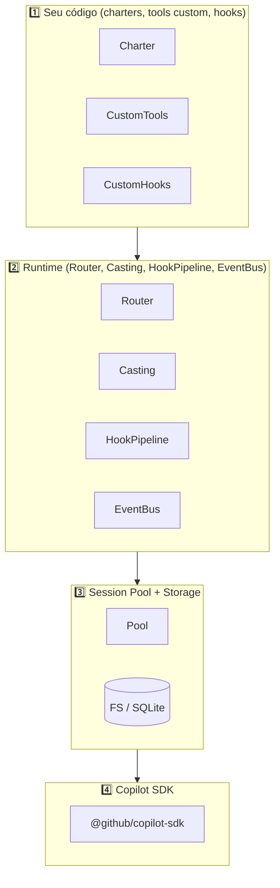

# 03. Arquitetura do Squad

> **Conceito → Como o Squad faz → Construa o seu → ✓ Validar**

## Conceito

Um orquestrador maduro de agents tem **camadas bem definidas**: o que é regra de negócio, o que é runtime, o que é I/O, o que é provedor LLM. Misturar tudo gera dívida técnica e impossibilita testar.

## Como o Squad faz

O Squad é organizado em **4 camadas**:



Mapa de pacotes (referência):

| Camada | Local no Squad | Cobertura no tutorial |
|---|---|---|
| 1 — Seu código | `.squad/` (charters, hooks YAML) | Phases 5, 8 |
| 2 — Runtime | `packages/squad-sdk/src/router`, `casting`, `hooks`, `events` | Phases 5, 8, 9 |
| 3 — Session Pool / Storage | `packages/squad-sdk/src/session`, `storage` | Phases 6, 7 |
| 4 — LLM | `packages/squad-sdk/src/client` (`SquadClient`) | Phase 3 |

CLI vive em `packages/squad-cli/`, consumindo a SDK — Phase 10.

## Construa o seu

Estrutura-alvo de `examples/mini-squad/`:

```
examples/mini-squad/
├── src/
│   ├── client/         # wrapper do Copilot SDK         (Phase 3)
│   ├── tools/          # ToolRegistry + tools built-in  (Phase 4)
│   ├── router/         # matchRoute, compileRules       (Phase 5)
│   ├── charter/        # tipos + carregamento           (Phase 5)
│   ├── casting/        # CastingEngine                  (Phase 5)
│   ├── session/        # AgentSession + Pool            (Phase 6)
│   ├── storage/        # FS / InMemory                  (Phase 7)
│   ├── hooks/          # HookPipeline                   (Phase 8)
│   ├── events/         # EventBus                       (Phase 9)
│   ├── ralph/          # monitor                        (Phase 9)
│   └── cli/            # commander + REPL               (Phase 10)
├── tests/              # vitest
└── examples-app/       # projeto final (Phase 11)
```

## ✓ Validar

1. Em qual camada vive a regra "agent X só pode escrever em `docs/**`"? *(2 — runtime/hooks)*
2. Trocar o LLM provider afeta qual camada? *(4 apenas — `SquadClient`)*
3. Onde mora o histórico persistido entre runs? *(3 — session pool + storage)*

> ⚠️ **Nota de honestidade arquitetural.** No Squad **real**, a "camada 4" não existe como código próprio: o LLM é chamado pelo **GitHub Copilot CLI**, e o Squad roda como um *custom agent* dentro dele (`copilot --agent squad --yolo`). Aqui no mini-squad implementamos a camada 4 nós mesmos para fins didáticos. Veja [Apêndice A1](../99-apendices/01-squad-real-vs-mini-squad.md) e o [Bônus A2](../99-apendices/02-bonus-mini-squad-como-agent-do-copilot-cli.md) para usar seu mini-squad **dentro** do Copilot CLI também.
