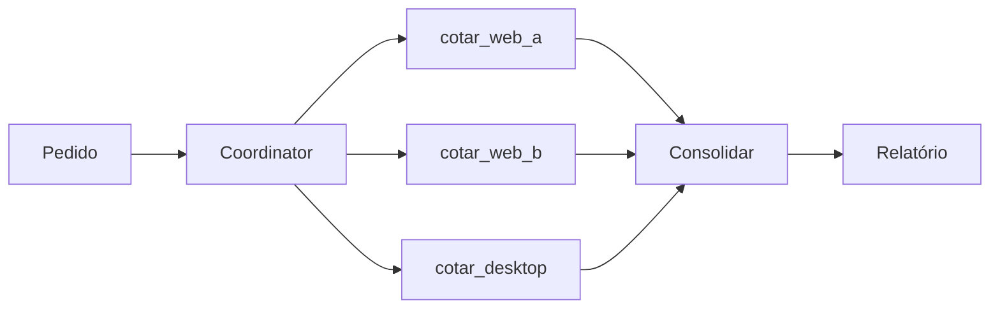

# 04. Orquestração de orçamento

> **Conceito → Como o Squad faz → Construa o seu → ✓ Validar**

## Conceito

Cotação é um caso clássico de **fan-out / fan-in**: dispara N tasks paralelas, espera todas, consolida. Aqui são 3 plataformas. Latência total ≈ max(t_A, t_B, t_C), não a soma.



## Como o Squad faz

Squad usa `spawnParallel` no Coordinator + `Promise.all`. Erros isolados (uma plataforma fora não cancela as outras).

## Construa o seu

[`src/orcamento/orquestrador.ts`](../../examples/mini-squad/src/orcamento/orquestrador.ts):

```ts
const cotacoes = await Promise.all([
  safeRun('WebA',    () => cotarWebA.run({ itens }, ctx)),
  safeRun('WebB',    () => cotarWebB.run({ itens }, ctx)),
  safeRun('Desktop', () => cotarDesktop.run({ itens }, ctx)),
]);
```

`safeRun` envolve cada chamada em `try/catch` e devolve um `CotacaoPlataforma` com `erro` setado. Isso preserva a propriedade "uma falha isolada".

> 💡 **Versão "agentica" pura** (Coordinator decide): troque `Promise.all` direto pelo loop ReAct via `Runtime` — o LLM emitirá 3 `tool_calls` na mesma mensagem (paralelos pelo SDK) ou em sequência. Cubra ambos os modos em testes.

## ✓ Validar

```bash
cd examples/mini-squad
npm test -- orcamento
# ✓ orquestrador de orçamento > produz relatório com 3 cotações e melhor cenário por item
```
