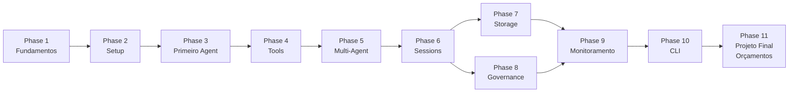
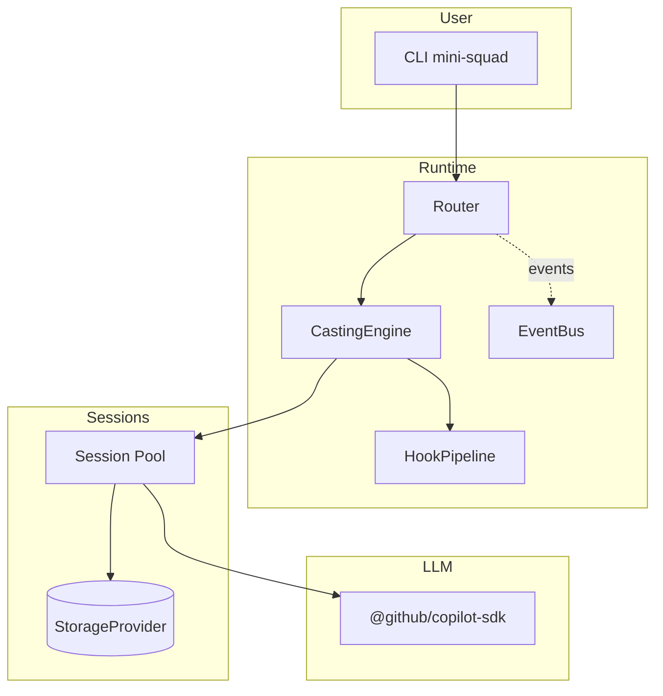

# Trilha 1 — SDK & Orquestração própria

> Construa do zero, em TypeScript, um orquestrador multi-agent (`mini-squad`) que termina cotando orçamentos em 3 plataformas paralelas.

## Como cada capítulo é estruturado

1. **Conceito** — a ideia em termos gerais.
2. **Como o Squad faz** — referência ao código real (`packages/squad-sdk/...`).
3. **Construa o seu** — implementação simplificada em [examples/mini-squad/](../../examples/mini-squad/).
4. **✓ Validar** — comando + saída esperada.

## Roadmap visual

## Arquitetura final (mini-squad)

## Índice

### [Phase 1 — Fundamentos](00-conceitos/)
- [01. O que é um agent](00-conceitos/01-o-que-e-um-agent.md)
- [02. Loop ReAct e tool-calling](00-conceitos/02-loop-react-e-tool-calling.md)
- [03. Arquitetura do Squad](00-conceitos/03-arquitetura-do-squad.md)

### [Phase 2 — Setup](01-setup/)
- [01. Ambiente e Copilot SDK](01-setup/01-ambiente-e-copilot-sdk.md)
- [02. Projeto mini-squad](01-setup/02-projeto-mini-squad.md)

### [Phase 3 — Primeiro agent](02-primeiro-agent/)
- [01. Chamando o Copilot SDK](02-primeiro-agent/01-chamando-copilot-sdk.md)
- [02. Streaming e eventos](02-primeiro-agent/02-streaming-e-eventos.md)

### [Phase 4 — Tools](03-tools/)
- [01. ToolRegistry pattern](03-tools/01-tool-registry-pattern.md)
- [02. Validação com Zod](03-tools/02-validacao-com-zod.md)
- [03. As 5 tools built-in do Squad](03-tools/03-squad-tools-builtin.md)

### [Phase 5 — Multi-agent](04-multi-agent/)
- [01. Router determinístico](04-multi-agent/01-router-deterministico.md)
- [02. Charters e personalidade](04-multi-agent/02-charters-e-personalidade.md)
- [03. CastingEngine](04-multi-agent/03-casting-engine.md)

### [Phase 6 — Sessions](05-sessions/)
- [01. Sessions persistentes](05-sessions/01-sessions-persistentes.md)
- [02. Crash recovery](05-sessions/02-crash-recovery.md)

### [Phase 7 — Storage](06-storage/)
- [01. StorageProvider abstrato](06-storage/01-storage-provider-abstrato.md)

### [Phase 8 — Governance](07-governance/)
- [01. Hook Pipeline](07-governance/01-hook-pipeline.md)
- [02. File-write guards](07-governance/02-file-write-guards.md)
- [03. PII scrub](07-governance/03-pii-scrub.md)
- [04. Rate limits e reviewer lockout](07-governance/04-rate-limits-reviewer-lockout.md)

### [Phase 9 — Monitoramento](08-monitoramento/)
- [01. EventBus typed pub/sub](08-monitoramento/01-event-bus.md)
- [02. Ralph monitor](08-monitoramento/02-ralph-monitor.md)

### [Phase 10 — CLI](09-cli/)
- [01. Construindo uma CLI](09-cli/01-construindo-uma-cli.md)

### [Phase 11 — Projeto Final](10-projeto-final/)
- [01. Modelagem do domínio](10-projeto-final/01-modelagem-do-dominio.md)
- [02. Agents especializados](10-projeto-final/02-agents-especializados.md)
- [03. Tools de integração](10-projeto-final/03-tools-de-integracao.md)
- [04. Orquestração de orçamento](10-projeto-final/04-orquestracao-de-orcamento.md)
- [05. Consolidação e relatório](10-projeto-final/05-consolidacao-e-relatorio.md)
- [06. CLI final](10-projeto-final/06-cli-final.md)

## Próximos passos

- Quer **rodar o mesmo mini-squad dentro do Copilot CLI**? → [Trilha 2](../track-2-copilot/README.md).
- Quer entender como **Claude Code** implementa essas mesmas ideias em escala produção? → [Trilha 3](../track-3-harness/README.md).
