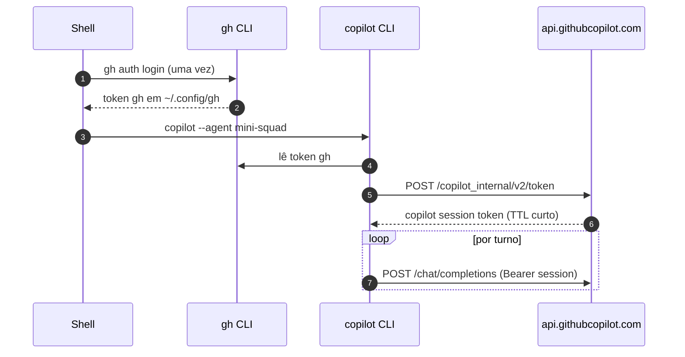

# 01. Conceitos — Squad real vs. mini-squad standalone

> **TL;DR:** Squad **não chama** SDK de LLM. Squad é um **plugin do Copilot CLI**. Quem fala com o modelo é o `copilot`.

## A diferença em uma tabela

| | Mini-squad standalone (Trilha 1) | Squad real / mini-squad como agent (Trilha 2) |
|---|---|---|
| Quem chama API LLM? | **Nosso código**, via `@github/copilot-sdk` | **GitHub Copilot CLI** |
| Onde está o loop ReAct? | `Runtime.run()` em [src/runtime/runtime.ts](../../examples/mini-squad/src/runtime/runtime.ts) | Dentro do binário `copilot` |
| Como "se acopla"? | Você roda o binário direto | É carregado: `copilot --agent mini-squad --yolo` |
| Quem cuida do token? | Quem rodar (env/credencial do SDK) | `gh auth login` → Copilot CLI troca por token de sessão |
| Multi-agent | Router + Casting em TS | Arquivos `.md` lidos pelo agent + scripts como tools |
| Hooks `before_tool` | `HookPipeline` intercepta no nosso loop | **Não rodam** automaticamente — precisam ir pra dentro da tool |

## Fluxo do token (Squad real)



**Nada disso passa pelo seu código.** Você não escreve `Authorization:` em lugar nenhum.

## O que **é** o agent custom?

Um arquivo Markdown. Frontmatter YAML define metadados + tools; o body é o **system prompt**:

```markdown
---
name: mini-squad
description: ...
tools:
  - name: mini_squad_orcar
    command: npx tsx src/cli/index.ts orcar -p {{pedido_path}} -o {{output_path}}
    parameters:
      pedido_path: { type: string }
      output_path: { type: string }
---

Você é o Mini-Squad Orchestrator...
```

Quando o LLM emite `tool_call: mini_squad_orcar(pedido_path="x.json", output_path="/tmp/o.md")`, o Copilot CLI:

1. Substitui `{{var}}`.
2. Executa `command` no shell.
3. Captura stdout como tool_result.
4. Devolve para o modelo no próximo turno.

## Quando NÃO usar esta trilha

| Cenário | Use… |
|---|---|
| Não tem Copilot pago | [Trilha 1](../track-1-sdk/) (você implementa o LLM provider) |
| Quer rodar em CI sem `gh auth` | [Trilha 1](../track-1-sdk/) ou Anthropic API direto |
| Precisa de hooks `before_llm`/`after_llm` próprios | [Trilha 1](../track-1-sdk/) (Copilot CLI não expõe isso) |
| Quer usar Anthropic/OpenAI/local em vez de Copilot | [Trilha 1](../track-1-sdk/) ou [Trilha 3](../track-3-harness/) |

## ✓ Validar

Responda mentalmente:

1. Quem é o processo Node rodando quando você digita `copilot --agent mini-squad`? *(o `copilot` CLI — não o mini-squad)*
2. Onde mora o loop ReAct nesse modo? *(dentro do `copilot` CLI)*
3. O que o mini-squad continua fazendo? *(servindo como CLI local que executa tools quando o agent invoca)*

## Próximo

→ [02. Setup: instalar Copilot CLI + autenticar](02-setup-copilot-cli.md)
