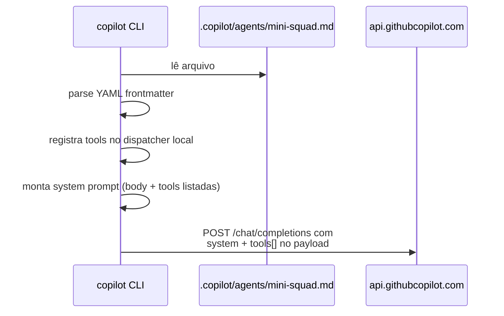

# 03. Anatomia de um agent `.md`

> Você vai dissecar — campo por campo — o arquivo que vira o agent custom. Ao fim, você consegue construir o seu do zero sem copiar.

## Estrutura

```
─────────────────────────────────
| YAML frontmatter (metadados)  |  ← entre --- ---
─────────────────────────────────
| Markdown body (system prompt) |  ← passa para o LLM
─────────────────────────────────
```

## Esqueleto mínimo

```markdown
---
name: meu-agent
description: O que esse agent faz, em uma linha
---

Você é um assistente que faz X. Siga as regras Y e Z.
```

Isso já é um agent **válido**. Sem tools custom — o agent só pode usar as tools nativas do Copilot CLI (`read_file`, `write_file`, `run_in_terminal` etc.).

## Frontmatter — campos suportados

| Campo | Tipo | Obrigatório | Descrição |
|---|---|---|---|
| `name` | string | ✅ | Nome usado em `--agent <nome>`. Sem espaços. |
| `description` | string | ✅ | Aparece em `copilot --list-agents`. |
| `tools` | array | — | Tools custom (próximo capítulo). |
| `model` | string | — | Sobrescreve modelo padrão (ex.: `claude-sonnet-4`, se disponível). |
| `temperature` | number | — | 0.0–1.0. Padrão: do CLI. |
| `max_tokens` | number | — | Limite por resposta. |
| `system_extra` | string | — | Append no system prompt (alternativa ao body). |
| `slash_commands` | array | — | Comandos `/algo` (capítulo 5). |
| `hooks` | array | — | Hooks pré/pós tool (capítulo 6). |

> **Esquema oficial.** Os campos exatos podem mudar entre versões do CLI. Sempre cheque `copilot --schema-agent` (se disponível) ou a doc oficial. Os listados acima são os mais estáveis.

## Body — o system prompt

Markdown puro. Recomendações que rendem agents melhores (skill `agent-harness-construction`):

1. **Identidade primeiro.** Uma frase: "Você é o X."
2. **Missão clara.** O que o agent **faz** e o que **não faz**.
3. **Regras numeradas.** Curtas, imperativas, em PT-BR.
4. **Tools listadas com propósito.** Modelo precisa saber **quando** chamar cada uma.
5. **Estilo de saída.** Formato esperado (tabela, JSON, lista).
6. **Condição de parada.** "Após X, **pare** e responda."

Anti-padrões a evitar:

- "Seja útil e amigável." → vago, desperdiça tokens.
- Repetir info que já está no `description`.
- Dar exemplos longos (use skills/files para isso).
- Deixar tools sem propósito explícito → modelo invoca à toa.

## Exemplo comentado completo

```markdown
---
name: mini-squad
description: Orquestrador multi-agent didático para orçamentos em 3 plataformas
model: claude-sonnet-4
temperature: 0.2
tools:
  - name: mini_squad_orcar
    description: Roda o orçamento de um pedido em paralelo nas 3 plataformas
    command: npx tsx src/cli/index.ts orcar -p {{pedido_path}} -o {{output_path}} --no-ralph
    parameters:
      pedido_path:
        type: string
        description: Caminho para o JSON do pedido
      output_path:
        type: string
        description: Caminho onde gravar o relatório Markdown
---

Você é o **Mini-Squad Orchestrator**, rodando dentro do GitHub Copilot CLI.

## Missão
Coordenar 4 sub-agents (Coordinator, WebAgentA, WebAgentB, DesktopAgent) para
produzir orçamentos consolidados a partir de pedidos JSON.

## Regras
1. Sempre confirme o caminho do pedido com o usuário antes de rodar `mini_squad_orcar`.
2. Após gerar o relatório, **leia-o** com `read_file` e resuma os 3 melhores SKUs.
3. **Nunca invente preços** — sempre venha das tools.
4. Após apresentar o resumo, **pare** e aguarde novo input.

## Estilo
PT-BR, direto, com tabelas Markdown para comparações.
```

## Como o Copilot CLI processa esse arquivo



O `tools[]` no payload da API tem o formato OpenAI/Anthropic function-calling. O Copilot CLI traduz seu YAML para isso automaticamente.

## ✓ Validar

```bash
cd examples/mini-squad
copilot --list-agents
# deve listar: mini-squad   Orquestrador multi-agent didático...

copilot --agent mini-squad --dry-run -p "diga oi"
# (--dry-run, se suportado, mostra o system prompt montado sem chamar a API)
```

Se `--dry-run` não existir na sua versão, use:

```bash
copilot --agent mini-squad -p "diga oi sem chamar nenhuma tool"
```

A resposta deve refletir a personalidade definida no body.

## Próximo

→ [04. Tools custom](04-tools-custom.md)
