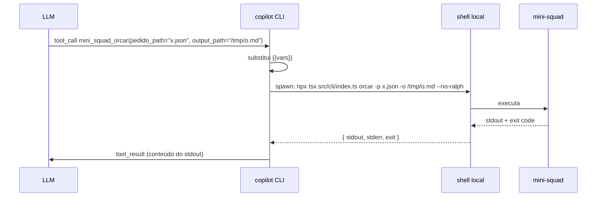

# 04. Tools custom — exponha seus comandos como function-calls

> Cada tool no frontmatter vira uma function-call que o LLM pode emitir. Esta é a ponte entre o **modelo** e o seu **mini-squad CLI**.

## Anatomia de uma tool

```yaml
tools:
  - name: mini_squad_orcar              # snake_case, único
    description: |                        # o LLM lê isso pra decidir quando chamar
      Roda o orçamento de um pedido em paralelo nas 3 plataformas
      e grava um relatório Markdown.
    command: npx tsx src/cli/index.ts orcar -p {{pedido_path}} -o {{output_path}} --no-ralph
    parameters:
      pedido_path:
        type: string                    # string | number | boolean | array | object
        description: Caminho para o JSON do pedido
        required: true                  # default: true se omitido
      output_path:
        type: string
        description: Caminho onde gravar o relatório
    timeout_seconds: 120                # opcional; padrão do CLI
    cwd: examples/mini-squad            # opcional; padrão = cwd atual
```

## Como funciona em runtime



> **Atenção a 3 coisas:**
> 1. `stdout` vai inteiro pro modelo — limite o volume (use `--quiet`, `--summary`, ou pipe `| head`).
> 2. `exit != 0` vira erro visível pro LLM, que decide se tenta de novo.
> 3. Strings longas em JSON consomem **tokens**. Prefira gravar arquivo + retornar path.

## As 3 tools do mini-squad

Vamos ter:

| Tool | Para quê | Comando |
|---|---|---|
| `mini_squad_orcar` | fluxo principal | `npx tsx src/cli/index.ts orcar -p {{pedido_path}} -o {{output_path}}` |
| `mini_squad_status` | diagnóstico | `npx tsx src/cli/index.ts status` |
| `mini_squad_run` | debug de agent isolado | `npx tsx src/cli/index.ts run --agent {{agent}} --input {{input}}` |

A definição completa está em [examples/mini-squad/.copilot/agents/mini-squad.md](../../examples/mini-squad/.copilot/agents/mini-squad.md).

## Boas práticas (do skill `agent-harness-construction`)

1. **Nomes estáveis e explícitos.** `mini_squad_orcar`, não `run_orc` ou `o`.
2. **Inputs schema-first e narrow.** Use `enum`, `pattern`, `min`/`max` quando possível.
3. **Output determinístico.** Sempre o mesmo formato pra mesma situação.
4. **Inclua próximas ações na resposta.** Ex.: `relatório salvo em /tmp/o.md — leia com read_file`.
5. **Erros úteis.** stderr deve ter: causa raiz + ação sugerida.

### Exemplo de stdout bom vs. ruim

❌ **Ruim:**
```
Done.
```

✅ **Bom:**
```
✓ relatório salvo em /tmp/o.md
total melhor cenário: R$ 1710,95
plataforma vencedora: WebB (todos os 3 SKUs)
próxima ação sugerida: read_file /tmp/o.md para ver o detalhamento
```

## Tipos de parâmetro suportados

| `type` | Exemplo de uso |
|---|---|
| `string` | paths, IDs, mensagens |
| `number` | timeouts, IDs numéricos |
| `boolean` | flags `--quiet`, `--no-cache` |
| `array` | listas de SKUs, multi-arquivo |
| `object` | configs aninhadas |
| `enum` | `enum: [json, markdown, csv]` |

Para arrays, no `command` use `{{items|join:" "}}` (sintaxe varia por versão — confira docs).

## Anti-padrões

- **Tools com nomes genéricos** (`run`, `do`, `exec`). Modelo confunde.
- **Tool que apenas embrulha outra**. Junte ou exponha a primária.
- **Output em JSON enorme**. Grava em arquivo, retorna path.
- **Sem `description`**. Modelo nunca chama a tool.
- **`command` com pipes complexos**. Ponha num script `.sh` e chame ele.

## Tools nativas do Copilot CLI (já disponíveis)

Mesmo sem declarar nada, o agent custom tem acesso a:

- `read_file`, `write_file`, `edit_file`
- `run_in_terminal` (BashTool equivalente)
- `glob`, `grep`
- `gh` (CLI do GitHub) via shell
- `web_fetch` (em algumas versões)

Use **suas** tools custom para coisas **específicas do domínio**. Não recrie `read_file`.

## ✓ Validar

```bash
cd examples/mini-squad
copilot --agent mini-squad -p "Mostre o status do mini-squad."
# o agent deve chamar mini_squad_status

copilot --agent mini-squad -p "Orce examples-app/pedido.json em /tmp/orc.md"
# o agent deve chamar mini_squad_orcar com os paths corretos
```

Se o modelo não chamar a tool, o problema **quase sempre** é `description` fraca. Reescreva.

## Próximo

→ [05. Slash commands custom](05-slash-commands-custom.md)
