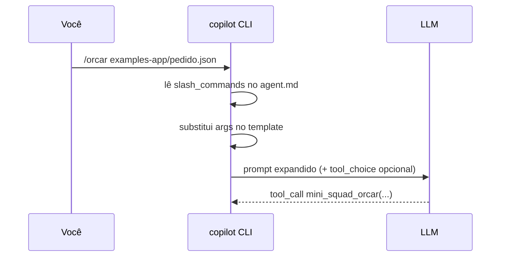

# 05. Slash commands custom

> Atalhos no chat: `/orcar pedido.json` em vez de "Por favor, rode o orçamento do pedido em pedido.json". Reduzem ambiguidade e padronizam workflows.

## Como funcionam

Slash commands são **macros** que:

1. **Capturam** argumentos do usuário.
2. **Expandem** para um prompt estruturado que vai pro LLM.
3. (Opcional) **Sugerem** a tool a chamar via `tool_choice`.



## Definição no frontmatter

```yaml
slash_commands:
  - name: orcar
    description: Cota um pedido em todas as plataformas
    parameters:
      pedido:
        type: string
        description: Caminho do JSON do pedido
        required: true
      output:
        type: string
        description: Path do relatório (default /tmp/orcamento.md)
        required: false
        default: /tmp/orcamento.md
    template: |
      Cote o pedido em {{pedido}} usando todas as plataformas disponíveis.
      Salve o relatório em {{output}} e me responda com:
      1. Total do melhor cenário
      2. Plataforma vencedora por SKU (tabela)
      3. Path do relatório completo
    tool_choice: mini_squad_orcar     # opcional; força a 1ª tool a ser essa

  - name: status
    description: Mostra o estado interno do mini-squad
    template: |
      Use mini_squad_status e me apresente um resumo em tópicos:
      - quantos agents
      - quantas tools registradas
      - quantas sessions ativas
    tool_choice: mini_squad_status

  - name: explicar
    description: Explica o último relatório gerado
    parameters:
      arquivo:
        type: string
        required: true
    template: |
      Leia o arquivo {{arquivo}} com read_file e me explique:
      - quem ganhou
      - por que (com base nos preços)
      - o que mudaria se eu desse 5% de desconto na pior plataforma
```

## Uso no chat

```
> /orcar examples-app/pedido.json
[mini_squad_orcar(...)]
✓ relatório salvo em /tmp/orcamento.md
total: R$ 1710,95...

> /orcar examples-app/pedido.json --output /tmp/custom.md
> /status
> /explicar /tmp/orcamento.md
```

## Convenções de naming

- **kebab-case**: `/code-review`, `/db-migrate`
- **verbos curtos**: `/orcar`, não `/fazer-orcamento`
- **um propósito por comando**: se virar genérico, divida

## Templates avançados

### Variáveis especiais

Algumas implementações expõem:

| Var | Conteúdo |
|---|---|
| `{{cwd}}` | diretório atual |
| `{{user}}` | login do GitHub |
| `{{date}}` | YYYY-MM-DD |
| `{{git_branch}}` | branch ativa |
| `{{selection}}` | texto selecionado (se em editor) |

### Combinar com tools nativas

```yaml
- name: review-pr
  description: Revisa um PR e comenta
  parameters:
    pr:
      type: number
      required: true
  template: |
    1. Use `gh pr diff {{pr}}` para pegar o diff.
    2. Identifique até 5 problemas reais.
    3. Use `gh pr comment {{pr}} --body "..."` para comentar.
    4. NÃO comente coisas estilísticas pequenas.
```

Note como o prompt ensina o **encadeamento** de tools nativas — sem precisar declarar nenhuma tool custom.

## Anti-padrões

- **Template longo demais.** Se passou de 15 linhas, vire skill ou doc separado.
- **`tool_choice` em comando genérico.** Trava o modelo numa solução só.
- **Variáveis não documentadas.** Sempre liste em `parameters` o que você usa.
- **Acentuação no `name`.** `/orçar` quebra. Use `/orcar`.

## Discoverability

```bash
copilot --agent mini-squad --list-commands
# orcar     Cota um pedido em todas as plataformas
# status    Mostra o estado interno do mini-squad
# explicar  Explica o último relatório gerado
```

Dentro do chat: digitar `/` lista os disponíveis (em modo interativo).

## ✓ Validar

```bash
cd examples/mini-squad
# 1. Comandos listados
copilot --agent mini-squad --list-commands 2>/dev/null \
  || echo "use --help; sintaxe varia por versão"

# 2. Comando funcionando
copilot --agent mini-squad -p "/status"
copilot --agent mini-squad -p "/orcar examples-app/pedido.json"
```

## Próximo

→ [06. Hooks & permissions](06-hooks-e-permissions.md)
