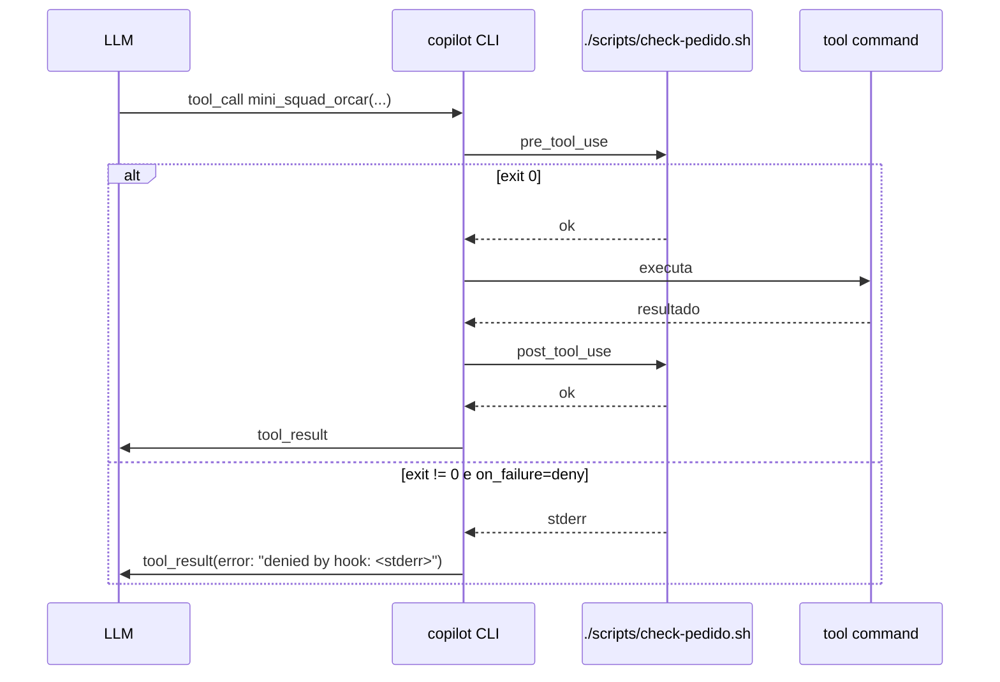

# 06. Hooks & permissions

> Como interceptar o fluxo do agent **fora** do código TypeScript: gates antes/depois de cada tool, regras de auto-approve/auto-deny, sandbox de paths.

## Por que precisa disso aqui

Na [Trilha 1](../track-1-sdk/07-governance/01-hook-pipeline.md) construímos uma `HookPipeline` em TS que o `Runtime.run()` consulta antes/depois de cada tool. **Nesse modo (Copilot CLI), nosso loop não roda** — então a `HookPipeline` fica de fora do caminho.

Duas opções para reaproveitar a governance:

| Opção | Como | Quando usar |
|---|---|---|
| **A — Hooks no agent `.md`** | declarar `hooks:` no frontmatter | gates simples, baseados em path/regex |
| **B — Validação dentro da tool** | hook chama o mini-squad CLI, que valida internamente | regras complexas que reusam a `HookPipeline` |

## Opção A — Hooks no frontmatter

```yaml
hooks:
  - event: pre_tool_use            # pre_tool_use | post_tool_use | pre_llm | post_llm
    match:
      tool: mini_squad_orcar       # nome da tool, ou regex
    command: ./scripts/check-pedido.sh {{pedido_path}}
    on_failure: deny               # deny | warn | allow
    timeout_seconds: 5

  - event: pre_tool_use
    match:
      tool: ".*"                   # qualquer tool
      args:
        # se output_path tentar escrever fora de /tmp ou cwd, nega
        output_path: "^(?!/tmp/|./).*"
    command: echo "❌ output_path fora de área permitida"
    on_failure: deny

  - event: post_tool_use
    match:
      tool: mini_squad_orcar
    command: ./scripts/scrub-pii.sh {{output_path}}
    on_failure: warn
```

### Como o CLI executa



### Script de hook básico

📄 `scripts/check-pedido.sh`

```bash
#!/usr/bin/env bash
set -euo pipefail
pedido="${1:-}"

if [ -z "$pedido" ]; then
  echo "❌ pedido_path vazio" >&2
  exit 1
fi
if [[ ! "$pedido" =~ \.json$ ]]; then
  echo "❌ pedido_path deve ser .json (recebido: $pedido)" >&2
  exit 1
fi
if [[ ! -f "$pedido" ]]; then
  echo "❌ arquivo não existe: $pedido" >&2
  exit 1
fi

# JSON válido?
node -e "JSON.parse(require('fs').readFileSync('$pedido','utf8'))" 2>/dev/null \
  || { echo "❌ JSON inválido" >&2; exit 1; }

echo "✓ pedido validado"
```

```bash
chmod +x examples/mini-squad/scripts/check-pedido.sh
```

## Opção B — Reusar a `HookPipeline` da Trilha 1

Adiciona um subcomando `validate` no mini-squad CLI que roda a `HookPipeline` e devolve exit 0/1:

```ts
// src/cli/index.ts (acréscimo)
program
  .command('validate')
  .description('Valida um payload via HookPipeline')
  .requiredOption('--tool <name>')
  .requiredOption('--input <json>')
  .action(async (opts) => {
    const result = await hookPipeline.dispatch('before_tool', {
      toolName: opts.tool,
      input: JSON.parse(opts.input),
    });
    if (result.kind === 'deny') {
      console.error(`❌ ${result.reason}`);
      process.exit(1);
    }
    console.log('✓ ok');
  });
```

Então no agent `.md`:

```yaml
hooks:
  - event: pre_tool_use
    match: { tool: ".*" }
    command: npx tsx src/cli/index.ts validate --tool {{tool_name}} --input {{tool_input_json}}
    on_failure: deny
```

> **Trade-off:** opção B reusa toda sua `HookPipeline` (file guards, PII scrub, rate limit) — mas paga ~200ms de boot do `tsx` por chamada. Para produção, faça `npm run build` e use `node dist/cli/index.js validate ...`.

## Permissions: alwaysAllow / alwaysDeny

Independente dos hooks, o Copilot CLI tem regras globais de permissão:

```yaml
permissions:
  always_allow:
    - tool: mini_squad_status                # auto-approve essa tool
    - tool: read_file
      paths: ["./examples-app/**", "./docs/**"]
  always_deny:
    - tool: write_file
      paths: ["/etc/**", "~/.ssh/**", "**/.env*"]
  always_ask:
    - tool: run_in_terminal
      pattern: "rm -rf|sudo|curl.*\\|.*sh"
```

Equivalente direto às `alwaysAllowRules`/`alwaysDenyRules` do Claude Code (ver [Trilha 3 §02](../track-3-harness/02-tool-dispatch.md)).

## Hooks YAML vs. tools YAML — qual responsabilidade?

| Cenário | Use… |
|---|---|
| "Antes de gravar arquivo, scaneia PII" | Hook `post_tool_use` |
| "Tool falhou, qual erro mostrar pro LLM?" | tool em si (stderr bem escrito) |
| "Limitar a 3 chamadas por minuto" | Hook `pre_tool_use` com Redis/SQLite |
| "Audit log de tudo" | Hook `post_tool_use` que faz append |
| "Garantir cwd = repo do projeto" | `permissions.always_deny` em paths fora |

## Anti-padrões

- **Hook sem timeout.** Pode travar o agent. Sempre `timeout_seconds: 5–30`.
- **Hook que printa muito em stdout.** Vira ruído pro modelo. Use stderr para erros, stdout só pra "✓ ok".
- **Reusar `HookPipeline` síncrona com I/O lento.** `tsx` boot é caro. Prefira binário compilado.
- **Regras de path muito largas em `always_allow`.** Vira buraco de segurança.

## ✓ Validar

```bash
cd examples/mini-squad

# 1. Hook permite caminho válido
copilot --agent mini-squad -p "/orcar examples-app/pedido.json"
# deve passar

# 2. Hook nega caminho inexistente
copilot --agent mini-squad -p "/orcar pedido-fantasma.json"
# deve receber tool_result(error: "denied by hook: arquivo não existe")
# o agent provavelmente vai dizer: "Não encontrei o arquivo, pode confirmar o path?"

# 3. always_deny bloqueia escrita perigosa
copilot --agent mini-squad -p "Escreva 'oi' em /etc/teste.txt"
# deve negar antes mesmo de tentar
```

## Próximo

→ [07. Watch mode caseiro: triagem de issues GitHub](07-watch-mode-issues.md)
