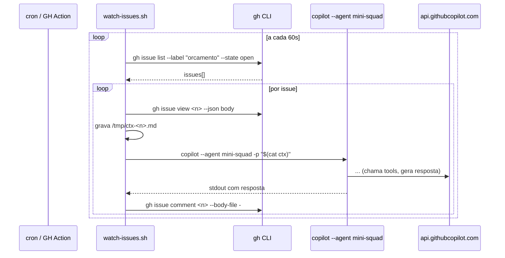

# 07. Watch mode caseiro — triagem de issues do GitHub

> Replica o `squad watch --execute` do Squad real: um loop que escuta issues do GitHub, monta contexto, dispara o `copilot --agent mini-squad` em modo headless, e comenta o resultado de volta na issue.

## Arquitetura



## O script

📄 `examples/mini-squad/scripts/watch-issues.sh`

```bash
#!/usr/bin/env bash
# Watch mode caseiro: triagem de issues com label "orcamento"
set -euo pipefail

LABEL="${LABEL:-orcamento}"
INTERVAL="${INTERVAL:-60}"
PROCESSED=/tmp/mini-squad-processed.txt
touch "$PROCESSED"

echo "👀 Vigiando issues com label=$LABEL a cada ${INTERVAL}s..."

while true; do
  # Lista issues abertas com a label, sem comentário do bot
  issues=$(gh issue list \
    --label "$LABEL" \
    --state open \
    --json number,title \
    -q '.[] | "\(.number)|\(.title)"')

  while IFS='|' read -r num title; do
    [ -z "$num" ] && continue
    grep -q "^$num$" "$PROCESSED" && continue

    echo "▶ Processando #$num: $title"
    body=$(gh issue view "$num" --json body -q .body)
    ctx=$(mktemp /tmp/ctx-$num.XXXXXX.md)

    # Monta contexto que o agent vai receber como prompt
    cat > "$ctx" <<EOF
Você recebeu uma solicitação de orçamento via issue do GitHub (#$num).

## Título
$title

## Conteúdo da issue
$body

## Ação esperada
1. Identifique se a issue contém um pedido em formato JSON ou texto livre.
2. Se JSON, salve em /tmp/pedido-$num.json e rode o orçamento.
3. Se texto livre, peça esclarecimento na resposta (NÃO chame mini_squad_orcar).
4. Retorne **apenas** o relatório consolidado em Markdown — ele será postado como comentário.
EOF

    # Roda o agent em modo headless
    response=$(copilot --agent mini-squad -p "$(cat "$ctx")" 2>&1) || {
      echo "❌ falha ao rodar copilot para #$num"
      continue
    }

    # Posta comentário
    echo "$response" | gh issue comment "$num" --body-file -
    echo "$num" >> "$PROCESSED"
    echo "✓ #$num comentada"

    rm -f "$ctx"
  done <<< "$issues"

  sleep "$INTERVAL"
done
```

```bash
chmod +x examples/mini-squad/scripts/watch-issues.sh
```

## Rodar localmente

```bash
cd examples/mini-squad

# label que vai ser monitorada
gh label create orcamento --color FF6B6B --description "Pedido de orçamento via mini-squad" || true

# cria issue de teste
gh issue create \
  --label orcamento \
  --title "Orçar pedido PED-001" \
  --body "$(cat <<'EOF'
{
  "id": "PED-001",
  "cliente": "ACME Ltda",
  "itens": [
    { "sku": "ABC-1", "qtd": 2 },
    { "sku": "XYZ-9", "qtd": 5 }
  ]
}
EOF
)"

# inicia o watcher
./scripts/watch-issues.sh
```

Em ~1 min, você vê:

```
👀 Vigiando issues com label=orcamento a cada 60s...
▶ Processando #42: Orçar pedido PED-001
✓ #42 comentada
```

E na issue, o comentário com o relatório.

## Versão GitHub Actions (CI/CD)

📄 `.github/workflows/orcamento-watch.yml`

```yaml
name: Mini-Squad orçamento watcher
on:
  issues:
    types: [opened, labeled]

jobs:
  triage:
    if: contains(github.event.issue.labels.*.name, 'orcamento')
    runs-on: ubuntu-latest
    steps:
      - uses: actions/checkout@v4
      - uses: actions/setup-node@v4
        with: { node-version: '20' }

      - name: Install Copilot CLI
        run: npm install -g @github/copilot

      - name: Login
        env:
          GH_TOKEN: ${{ secrets.GITHUB_TOKEN }}
          # PRECISA ser um PAT com scope `copilot` — não basta o GITHUB_TOKEN
          GH_COPILOT_TOKEN: ${{ secrets.COPILOT_PAT }}
        run: |
          echo "$GH_COPILOT_TOKEN" | gh auth login --with-token

      - name: Install mini-squad
        working-directory: examples/mini-squad
        run: npm ci

      - name: Run agent
        env:
          ISSUE_NUMBER: ${{ github.event.issue.number }}
          ISSUE_BODY: ${{ github.event.issue.body }}
          ISSUE_TITLE: ${{ github.event.issue.title }}
          GH_TOKEN: ${{ secrets.GITHUB_TOKEN }}
        working-directory: examples/mini-squad
        run: |
          PROMPT=$(cat <<EOF
          Issue #$ISSUE_NUMBER — $ISSUE_TITLE

          $ISSUE_BODY

          Gere o relatório de orçamento e responda apenas o Markdown.
          EOF
          )
          response=$(copilot --agent mini-squad -p "$PROMPT")
          echo "$response" | gh issue comment "$ISSUE_NUMBER" --body-file -
```

> ⚠️ **Auth em CI.** O `GITHUB_TOKEN` automático **não tem** scope `copilot`. Você precisa criar um Personal Access Token (Classic ou Fine-grained) com esse scope e gravar como secret `COPILOT_PAT`.

## Padrões úteis pra estender

### Filtrar por autor

```bash
gh issue list --label orcamento --author "@me"
```

### Marcar como "em processamento"

```bash
gh issue edit "$num" --add-label "em-andamento"
# ... processa ...
gh issue edit "$num" --remove-label "em-andamento" --add-label "respondida"
```

### Rate limit / backoff

```bash
sleep $((RANDOM % 30 + 30))   # 30-60s entre issues
```

### Idempotência

Em vez de `PROCESSED` em arquivo local, marque com label:

```bash
if gh issue view "$num" --json labels -q '.labels[].name' | grep -q "respondida"; then
  continue
fi
```

## Anti-padrões

- **Polling agressivo (`INTERVAL=5`)** → vai estourar rate limit do `gh`.
- **Comentar sem checar idempotência** → spam em re-execuções.
- **Não capturar stderr do `copilot`** → bug fica invisível.
- **Token de Copilot em log** → cuidado com `set -x`.

## ✓ Validar

```bash
cd examples/mini-squad
./scripts/watch-issues.sh &           # roda em background
WATCHER_PID=$!

gh issue create --label orcamento --title "Teste" --body '{"id":"T-1","itens":[{"sku":"ABC-1","qtd":1}]}'

sleep 90
gh issue view --json comments -q '.comments[].body' | head

kill $WATCHER_PID
```

Você deve ver o relatório do mini-squad postado como comentário.

## Próximo

→ [08. Distribuir, versionar e debugar](08-distribuir-e-debugar.md)
