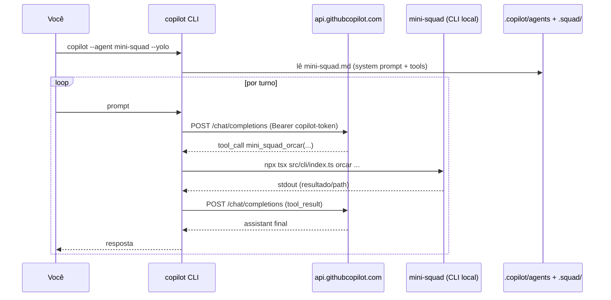
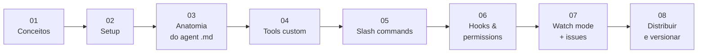

# Trilha 2 — Copilot CLI (`copilot --agent mini-squad`)

> Aprenda a transformar o **GitHub Copilot CLI** em um orquestrador multi-agent custom — sem reinventar transport, auth ou loop ReAct. O Copilot já fala com o LLM; você só fornece **contexto + tools + regras**.

## Por que esta trilha existe

Na [Trilha 1](../track-1-sdk/README.md) construímos `mini-squad` como um binário **standalone** que chama o Copilot SDK direto. Mas o **Squad real** ([bradygaster/squad](https://github.com/bradygaster/squad)) faz diferente: ele roda **dentro** do Copilot CLI como um *custom agent*.

Esta trilha mostra o caminho real, com o **mesmo** mini-squad servindo de "back-end" de tools.

> **TL;DR:** o Copilot CLI é o **runtime LLM**, o mini-squad é o **conjunto de tools**, e o `.md` no `.copilot/agents/` é o **contrato entre os dois**.

## Roadmap

## Índice

1. [Conceitos: Squad real vs. mini-squad](01-conceitos-squad-real-vs-mini-squad.md)
2. [Setup: instalar Copilot CLI + autenticar](02-setup-copilot-cli.md)
3. [Anatomia de um agent `.md` (frontmatter + system prompt)](03-anatomia-agent-md.md)
4. [Tools custom: expor seus comandos como function-calls](04-tools-custom.md)
5. [Slash commands custom (`/orcar`, `/status`)](05-slash-commands-custom.md)
6. [Hooks & permissions: gates antes/depois das tools](06-hooks-e-permissions.md)
7. [Watch mode caseiro: triagem de issues GitHub](07-watch-mode-issues.md)
8. [Distribuir, versionar e debugar seu agent](08-distribuir-e-debugar.md)

## Pré-requisitos

| Item | Como obter |
|---|---|
| Node.js 20+ | [nodejs.org](https://nodejs.org) ou `nvm` |
| `gh` CLI autenticado | `brew install gh && gh auth login` |
| Copilot CLI | `gh extension install github/gh-copilot` **ou** `npm i -g @github/copilot` |
| Acesso ao GitHub Copilot | conta paga ou trial |
| Mini-squad rodando | seguir [Trilha 1 §02](../track-1-sdk/01-setup/02-projeto-mini-squad.md) |

> Não precisa terminar a Trilha 1 inteira. Só basta ter `examples/mini-squad/` com `npm install` feito e `npx tsx src/cli/index.ts status` funcionando.

## ✓ Resultado final esperado

Ao fim desta trilha você terá:

1. Um `.copilot/agents/mini-squad.md` completo com 5+ tools, hooks de validação e slash commands.
2. Capacidade de rodar `copilot --agent mini-squad --yolo` e ter um chat orquestrando os 4 sub-agents do mini-squad.
3. Um script de **watch mode** que escuta issues do GitHub com label `orcamento` e responde com relatórios automáticos via Copilot.
4. Versionamento e troubleshooting do agent (`copilot --list-agents`, logs verbosos, dry-run de tools).

## Próximo

→ [01. Conceitos: Squad real vs. mini-squad](01-conceitos-squad-real-vs-mini-squad.md)
