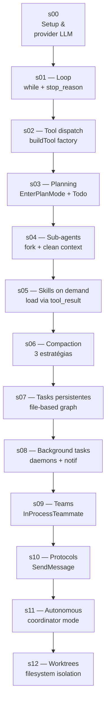
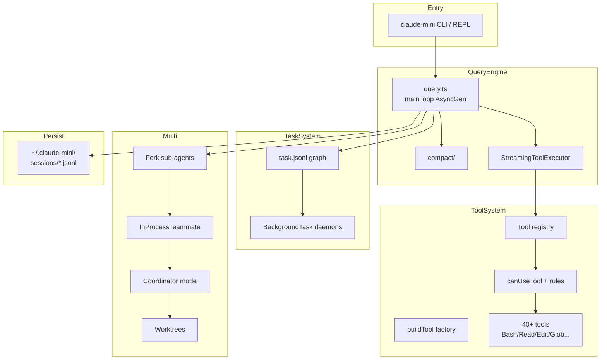

# Trilha 3 — Construindo um Harness (estilo Claude Code)

> Aprenda **como funciona um harness production-grade** construindo `claude-mini` — uma versão didática que replica os **12 mecanismos progressivos** do Claude Code v2.1.88.

## Por que esta trilha existe

Loop ReAct + tool-calling é só **5% do que faz um harness sério funcionar**. Os outros 95% são planejamento, sub-agents, compaction, persistence, permissions, sandbox, swarm — coisas que aparecem quando o agent precisa rodar **horas** num projeto real.

A trilha analisa o [`claude-code-source-code`](https://github.com/DouglasHennrich/claude-code-source-code) (Claude Code v2.1.88 reverse engineered) e te ensina a construir cada camada **incrementalmente**.



> **Construímos `claude-mini`, não `claude-code`.** Cada mecanismo é uma versão simplificada cabível em ~200 linhas, com foco no padrão arquitetural — não em paridade de features.

## Arquitetura final (claude-mini)



## Índice

### Setup
- [s00. Setup do projeto + escolha do provider LLM](s00-setup-e-provider-llm.md)

### Os 12 mecanismos progressivos
- [s01. The Loop — `while + stop_reason`](s01-the-loop.md)
- [s02. Tool Dispatch — `buildTool` factory](s02-tool-dispatch.md)
- [s03. Planning — Plan Mode + Todo](s03-planning.md)
- [s04. Sub-Agents — fork + contexto limpo](s04-sub-agents.md)
- [s05. Skills on Demand — load via `tool_result`](s05-skills-on-demand.md)
- [s06. Context Compression — 3 estratégias](s06-context-compression.md)
- [s07. Persistent Tasks — grafo de tarefas em disco](s07-persistent-tasks.md)
- [s08. Background Tasks — daemons + notificações](s08-background-tasks.md)
- [s09. Teams — `InProcessTeammate`](s09-teams.md)
- [s10. Team Protocols — `SendMessage`](s10-team-protocols.md)
- [s11. Autonomous Mode — coordinator loop](s11-autonomous-mode.md)
- [s12. Worktree Isolation — sandbox por agent](s12-worktree-isolation.md)

## Estrutura de cada capítulo

```
1. O que é (~3 linhas)
2. Como Claude Code faz (referência ao arquivo real)
3. Versão didática (claude-mini) — código completo, ~150-300 linhas
4. Por que esse padrão? (trade-offs)
5. ✓ Validar (comando + saída)
```

## Referência cruzada — Claude Code → claude-mini

| Mecanismo | Claude Code (arquivo real) | Nosso `claude-mini` |
|---|---|---|
| s01 | `query.ts` (785 KB) | `src/query.ts` (~200 linhas) |
| s02 | `Tool.ts`, `tools.ts` | `src/tools/registry.ts` |
| s03 | `EnterPlanModeTool/`, `TodoWriteTool/` | `src/tools/plan-mode.ts` |
| s04 | `AgentTool/`, `forkSubagent.ts` | `src/agents/fork.ts` |
| s05 | `SkillTool/`, `memdir/` | `src/skills/loader.ts` |
| s06 | `services/compact/` | `src/compact/{auto,snip,collapse}.ts` |
| s07 | `TaskCreate/Update/Get/List` | `src/tasks/store.ts` |
| s08 | `DreamTask/`, `LocalShellTask/` | `src/tasks/background.ts` |
| s09 | `TeamCreateTool/`, `InProcessTeammateTask/` | `src/teams/in-process.ts` |
| s10 | `SendMessageTool/` | `src/teams/messaging.ts` |
| s11 | `coordinator/coordinatorMode.ts` | `src/teams/coordinator.ts` |
| s12 | `EnterWorktreeTool/` | `src/sandbox/worktree.ts` |

## Pré-requisitos

- Trilhas 1 e 2 **não são obrigatórias**, mas familiaridade com agents (loop, tools) acelera muito.
- Node 20+, TypeScript estrito, Vitest.
- Provider LLM:
  - **Anthropic API** (recomendado): `ANTHROPIC_API_KEY` em `.env`. Ver [s00](s00-setup-e-provider-llm.md).
  - **Alternativa**: adaptar para Copilot SDK (também coberto em s00).

## Aviso legal

Esta trilha referencia o repositório [`DouglasHennrich/claude-code-source-code`](https://github.com/DouglasHennrich/claude-code-source-code), que contém código-fonte da Anthropic descompilado a partir do `cli.js` v2.1.88. **Uso comercial é proibido pelo aviso de copyright original.** Esta trilha:

- ✅ Cita arquitetura, padrões e nomes de arquivo para fins educacionais.
- ✅ Constrói uma reimplementação **didática e simplificada** (`claude-mini`).
- ❌ Não copia código verbatim do Claude Code.
- ❌ Não é endossada pela Anthropic.

Se for publicar derivativos, leia o [LICENSE](https://github.com/DouglasHennrich/claude-code-source-code/blob/main/README.md) original.

## Próximo

→ [s00. Setup do projeto + escolha do provider LLM](s00-setup-e-provider-llm.md)
