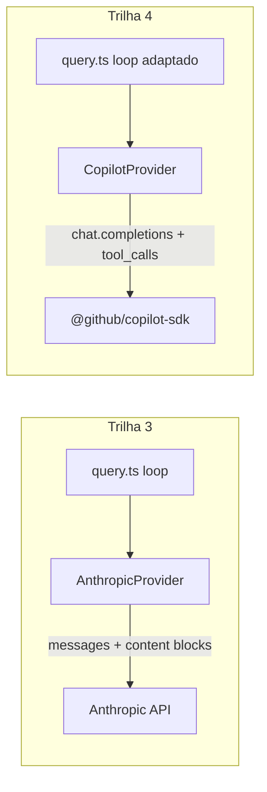

# Trilha 4 — Harness estilo Claude Code com **Copilot como LLM**

> Esta trilha mostra como **reaproveitar todo o harness** construído na [Trilha 3](../track-3-harness/README.md) trocando apenas o `LlmProvider` para usar o **GitHub Copilot SDK** (formato OpenAI Chat Completions) no lugar da Anthropic Messages API.

## Por que existe

Trilha 1 = SDK puro (`mini-squad`, conversa Copilot ⇄ orquestrador caseiro).
Trilha 2 = Copilot CLI hospedando seu agent.
Trilha 3 = harness `claude-mini` com Anthropic.
**Trilha 4 = harness `claude-mini` com Copilot.**

Resultado: você tem **planning, sub-agents, compaction, tasks, teams, coordinator, worktrees** — alimentados pelo seu plano Copilot, sem precisar de `ANTHROPIC_API_KEY`.

## É possível? Sim, com 3 adaptações

| Diferença | Anthropic (T3) | Copilot/OpenAI (T4) |
|---|---|---|
| Estrutura da resposta | `content[]` blocks (`text`, `tool_use`, `tool_result`) | `message.content` + `message.tool_calls[]` |
| Tools | `{name, description, input_schema}` | `{type:"function", function:{name, description, parameters}}` |
| Tool result | bloco `tool_result` em mensagem `user` | mensagem `role:"tool"` com `tool_call_id` |
| Stop reason | `end_turn` / `tool_use` / `max_tokens` | `stop` / `tool_calls` / `length` |
| System prompt | parâmetro `system` separado | mensagem `role:"system"` no array |
| Streaming | event stream com block deltas | chunks com `choices[0].delta` |

Tudo isolado num **adapter**: o resto do código (loop, sub-agents, compaction, tasks, teams) **não muda**.

## Capítulos

- [t00. Visão geral & decisão de adapter](t00-visao-geral.md)
- [t01. CopilotProvider — Chat Completions adapter](t01-copilot-provider.md)
- [t02. Loop adaptado — `tool_calls` vs `tool_use`](t02-loop-adaptado.md)
- [t03. Tools no formato OpenAI function-calling](t03-tools-openai-format.md)
- [t04. Reaproveitando os 12 mecanismos](t04-reaproveitando-mecanismos.md)
- [t05. Setup, autenticação e uso](t05-setup-e-uso.md)

## Exemplo de código

📂 [`examples/claude-mini-copilot/`](../../examples/claude-mini-copilot/) — projeto isolado, espelha estrutura do `claude-mini` mas com:

- `src/provider/copilot.ts` — wrapper sobre `@github/copilot-sdk`.
- `src/provider/types.ts` — interface comum (Message OpenAI-style).
- `src/query.ts` — loop adaptado para `tool_calls`.
- `src/tools/registry.ts` — `toSpecs()` no formato OpenAI.
- Resto (`agents/`, `compact/`, `tasks/`, `teams/`, `coordinator/`, `worktree/`) idêntico ao `claude-mini`.

## Pré-requisitos

- Trilha 3 lida (entende `claude-mini`).
- Token Copilot (`COPILOT_TOKEN`) ou `gh auth login` válido.
- Node 20+, mesmas deps da Trilha 3.

## Quando preferir T4 vs T3

| Cenário | Use |
|---|---|
| Plano Copilot pago, sem créditos Anthropic | T4 |
| Quer Sonnet 4.5 nativo / extended thinking | T3 |
| Já está no ecossistema GitHub (Actions, Copilot Workspace) | T4 |
| Quer prompt cache fine-grained | T3 (Anthropic só) |
| Streaming SSE com event types ricos | T3 |
| Tool-calling clássico OpenAI | T4 |

← [Voltar ao hub](../README.md)
