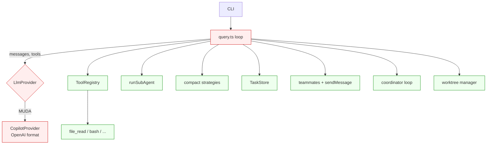

# t00. Visão geral & decisão de adapter

## A pergunta

> "Posso usar o `claude-mini` com Copilot como LLM, igual ao `mini-squad` faz?"

Resposta curta: **sim, isolando o protocolo num adapter**.

## Por que não usar direto

`claude-mini` foi escrito assumindo o protocolo da **Anthropic Messages API**:

```ts
// src/provider/types.ts (Trilha 3)
export type ContentBlock =
  | { type: 'text'; text: string }
  | { type: 'tool_use'; id: string; name: string; input: unknown }
  | { type: 'tool_result'; tool_use_id: string; content: string; is_error?: boolean };
```

Copilot/OpenAI Chat Completions usa formato diferente:

```ts
{
  role: 'assistant',
  content: 'texto opcional',
  tool_calls: [{
    id: 'call_xxx',
    type: 'function',
    function: { name: 'bash', arguments: '{"command":"ls"}' },
  }],
}
// e a resposta da tool:
{ role: 'tool', tool_call_id: 'call_xxx', content: 'arquivos: ...' }
```

Forçar um no outro daria gambiarra. **Solução**: cada trilha tem seu próprio `Message`/`StreamEvent` interno, e o `LlmProvider` traduz na fronteira.

## Camadas que mudam (vermelho) e que não mudam (verde)



## O que muda concretamente

1. **`src/provider/types.ts`** — `Message`/`StreamEvent` em formato OpenAI.
2. **`src/provider/copilot.ts`** — wrapper sobre `@github/copilot-sdk` (chat.completions).
3. **`src/query.ts`** — adapta loop para detectar `tool_calls` (não `tool_use blocks`) e responder com `role:"tool"` (não `tool_result` block).
4. **`src/tools/registry.ts`** — método `toSpecs()` retorna `{type:"function", function:{...}}`.

Tudo o que **não usa diretamente o protocolo do LLM** (sub-agents, compact, tasks, teams, coordinator, worktree) segue **literalmente igual**.

## Trade-offs do adapter

✅ **Prós**

- Reaproveita 100% das tools (`file_read`, `bash`, `grep`, etc).
- Reaproveita 100% das primitivas avançadas (compact, tasks, teams).
- Sem dependência de `ANTHROPIC_API_KEY`.
- Quem já usa GitHub paga 1 vez.

⚠️ **Contras**

- Sem prompt cache fino (Copilot/OpenAI não expõem `cache_control`).
- Sem extended thinking (Sonnet/Opus apenas).
- Modelos disponíveis dependem do plano Copilot.
- Function calling do GPT-4o tem **limites de paralelismo de tools** menores que Claude.

## Decisão arquitetural

> **Manter dois pacotes independentes**: `examples/claude-mini` (Anthropic) e `examples/claude-mini-copilot` (Copilot).
>
> Uma única base de código com `if (provider === 'anthropic')` poluiria o loop e tornaria a aprendizagem mais difícil. Para um tutorial **didático**, dois exemplos paralelos > 1 abstrato.

Em produção, você provavelmente faria uma camada `IProtocol` única que normaliza ambos — fica como exercício.

## Próximo

→ [t01. CopilotProvider — Chat Completions adapter](t01-copilot-provider.md)
